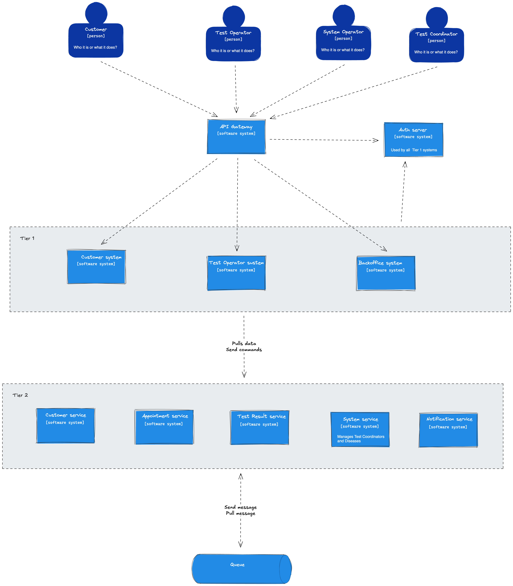

The chosen architecture is microservices. The reasoning is described in [ADR-001 Solution architecture](../ADR/ADR-001%20Solution%20architecture.md).

The high level idea is that the system is divided into two layers:
- Tier 1 - all users' facing applications
- Tier 2 - all the services that actually implement domain specific logic

This approach is visualised on the C1 diagram.

## Tier 1

The main idea is that those are web applications. Each will consists of:
 - frontend application
	 - implements UI
 - backend for frontend
	 - fetches and glues data from Tier 2 services
	 - sends commands to Tier 2 services

Components defined as Tier 1:
- [Customer system](./Customer%20system.md)
- [Test Operator system](./Test%20Operator%20system.md)
- [Backoffice system](./Backoffice%20system.md)
- Doctors system

Additionally
- all frontend applications will use our Auth server for authentication
	- [ADR-004 Auth server](../ADR/ADR-004%20Auth%20server.md)
- all frontend backends will be accessed via API gateway
	- [ADR-005 API Gateway](../ADR/ADR-005%20API%20Gateway.md)

## Tier 2

Those will be domain specific services that encapsulate some solution space.

In general we need to support those communication patterns:
- network calls between Tier 1 and 2
- network calls between Tier 2
- sending messages to message broker

See [ADR-006 Network protocol](../ADR/ADR-006%20Network%20protocol.md) and [ADR-007 Message broker](../ADR/ADR-007%20Message%20broker.md).

We defined the following components as Tier 2 services:
- [Customer service](./Customer%20service.md)
- [Appointment service](./Appointment%20service.md)
- [Test Result service](./Test%20Result%20service.md)
- System service
- [Notifications service](./Notifications%20service.md)

