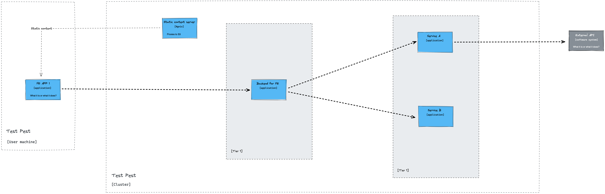
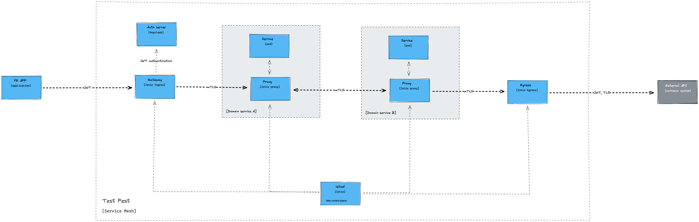
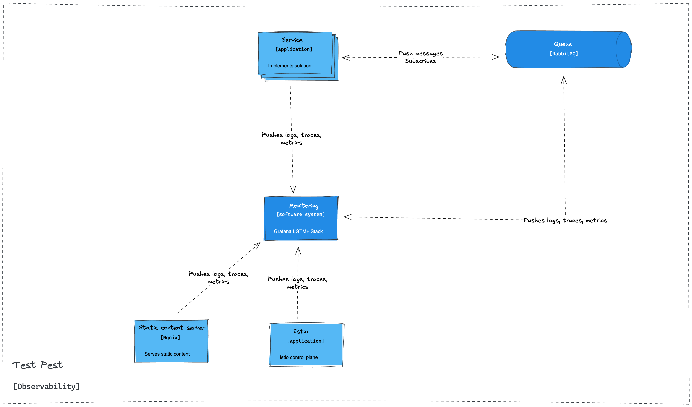
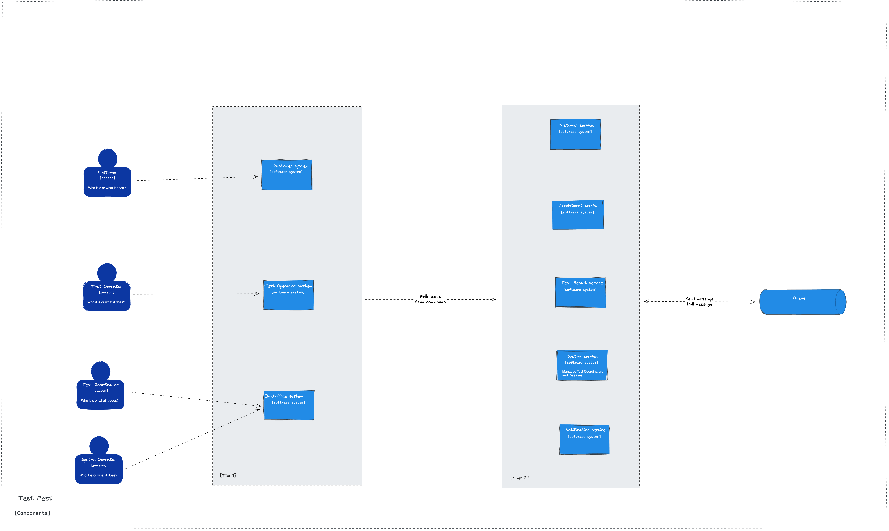

# Architecture

The chosen architecture is microservices. The reasoning is described in [ADR-001 Solution architecture](../ADR/ADR-001%20Solution%20architecture.md).

The high level idea is that the system is divided into two layers:
- Tier 1 - all users' facing applications
- Tier 2 - all the services that actually implement domain specific logic

High level architecture diagram:

## Tier 1

We will expose functionalities via web applications. Each will consist of:
 - frontend application
	 - implements UI
     - see [ADR-011 Applications](../ADR/ADR-011%20Applications.md) for details
 - backend for frontend
	 - fetches and glues data from Tier 2 services
	 - sends commands to Tier 2 services

Additional considerations:
- all frontend applications will use our Auth server for authentication
	- [ADR-005 Auth server](../ADR/ADR-005%20Auth%20server.md)
- all frontend backends will communicate with their backend using REST over HTTP
	- [ADR-003 North-South traffic management](../ADR/ADR-003%20North-South%20traffic%20management.md)

## Tier 2

Those will be domain specific services that encapsulate some solution space.

In general, we need to support those communication patterns:
- network calls between Tier 1 and 2
- network calls between Tier 2
- sending messages to message broker

# Platform

We decided to use Kubernetes as our platform. The reasoning is described in [ADR-002 Infrastructure](../ADR/ADR-002%20Infrastructure.md).

## Communication

We need to support two types of communication patters:
1. North-South - inbound to our system
2. East-West - between components in our system

### North-South

Inbound communication will be handled by Istio Gateway - see [ADR-003 North-South traffic management](../ADR/ADR-003%20North-South%20traffic%20management.md).

### East-West

- communication between services will be handled by Istio Service Mesh - see [ADR-004 East-West traffic management](../ADR/ADR-004%20East-West%20traffic%20management.md).
- as a protocol we chose REST over HTTP - see [ADR-006 Service to service protocol](../ADR/ADR-006%20Service%20to%20service%20protocol.md).

## Asynchronous

We will use RabbitMQ as our message broker - see [ADR-007 Message broker](../ADR/ADR-007%20Message%20broker.md)

## Static content

We need to serve static content for two use cases:
- frontend applications
- domain specific files

For that we will use:
- S3 compliant storage - see [ADR-008 Object Storage](../ADR/ADR-008%20Object%20Storage.md)
- nginx to serve static content - see [ADR-010 Static content](../ADR/ADR-010%20Static%20content.md)

## Observability

For observability we will Grafana stack - see [ADR-009 Observability](../ADR/ADR-009%20Observability.md)

## Database

- each microservice will have its own database
- microservice should not share database
  - if data is needed it should be exposed via public API
- we will use PostgreSQL as our database - see [ADR-012 Database](../ADR/ADR-012%20Database.md)

# Components

High level overview of components

## Tier 1

- [Customer system](./Customer%20system.md)
  - customer facing web application 
- [Test Operator system](./Test%20Operator%20system.md)
  - test operator facing web application 
- [Backoffice system](./Backoffice%20system.md)
  - application for managing the system
  - will be used by System Operators and Test Coordinators
- Doctors system
  - will be used by doctors to access customer test history 

## Tier 2

We defined the following components as Tier 2 services:
- [Customer service](./Customer%20service.md)
  - main functionality is to store customer data 
  - we need to support CRUD operations
  - reading will need to be optimised for couple of use cases
    - by email
    - by id
    - by name
    - by phone number
    - by Identification Number (e.g. PESEL)
- [Appointment service](./Appointment%20service.md)
  - CRUD for appointments
  - reading must be optimized by couple of use cases
	- by Customer
	- by date (for loading calendar)
    - by Test Operator
- [Test Result service](./Test%20Result%20service.md)
  - CRUD for test results
  - reading must be optimized by couple of use cases
    - by Test id
    - by Customer
  - sending notifications
  - pushing test result further
    - BI system
    - Doctors' service (or Test history service)
- System service
  - CRUD for system configuration
    - Disease Test
    - Test Operator
    - Test Coordinators
- [Notifications service](./Notifications%20service.md)
  - subscribing to messages and sending notifications
    - via email gateway
    - via SMS gateway
  - CRUD for notifications templates

