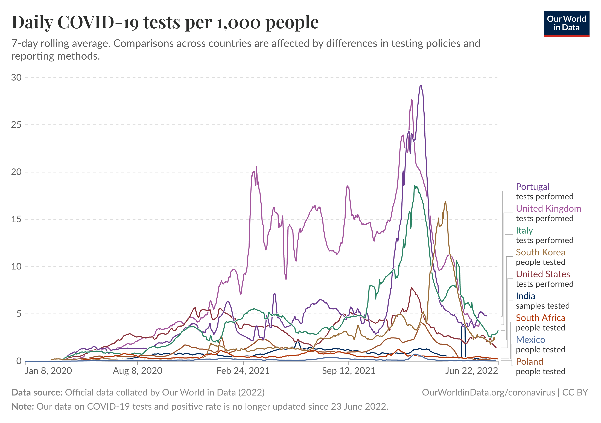

# Customers

- 40 millions
- but we should be able to handle more if system is exported to other countries

# Test Result

During the peak of pandemics the best performing countries were carrying out 30 tests per 1000 people.

After simple math this gives us about **1.2 million of tests per day**.

- we need to clear test results data after some time period
- this time period should be configurable
	- it the event of global event the number of tests might explode making scaling hard
- system must handle more as it could be exported to different countries

# Test Operators

- let's assume operator can make 4 tests per hour
- that gives 32 tests per a day
- 1.2 million divided by 32 gives roughly 40k operators

## OP/s

1.2m tests/day / (3600s * 8) = ~41 operations per second 
28800 - secs in 8 hours

# Doctors
 - thousands

# Government officials
- hundreads
